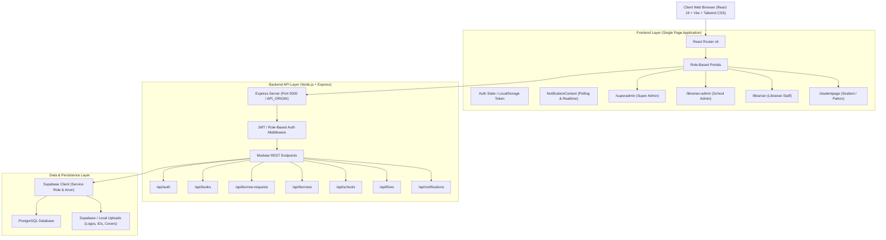
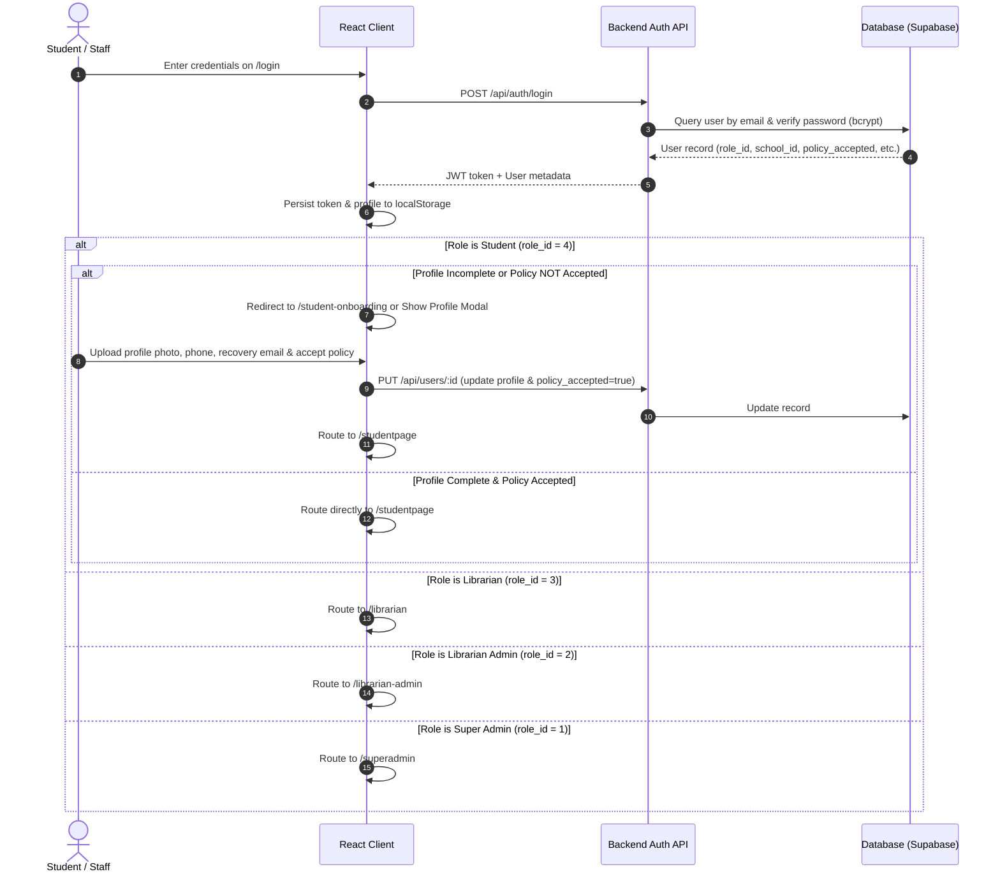
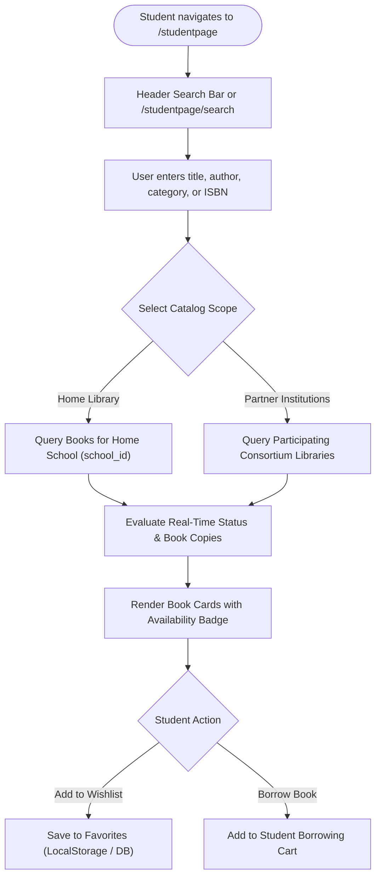
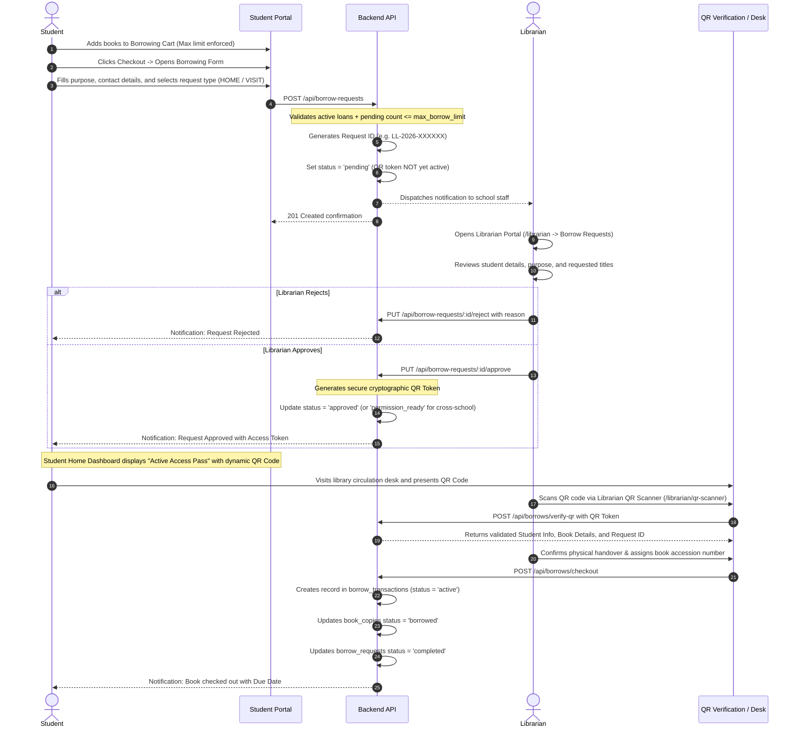
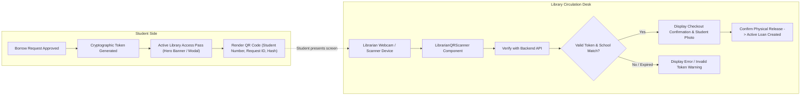
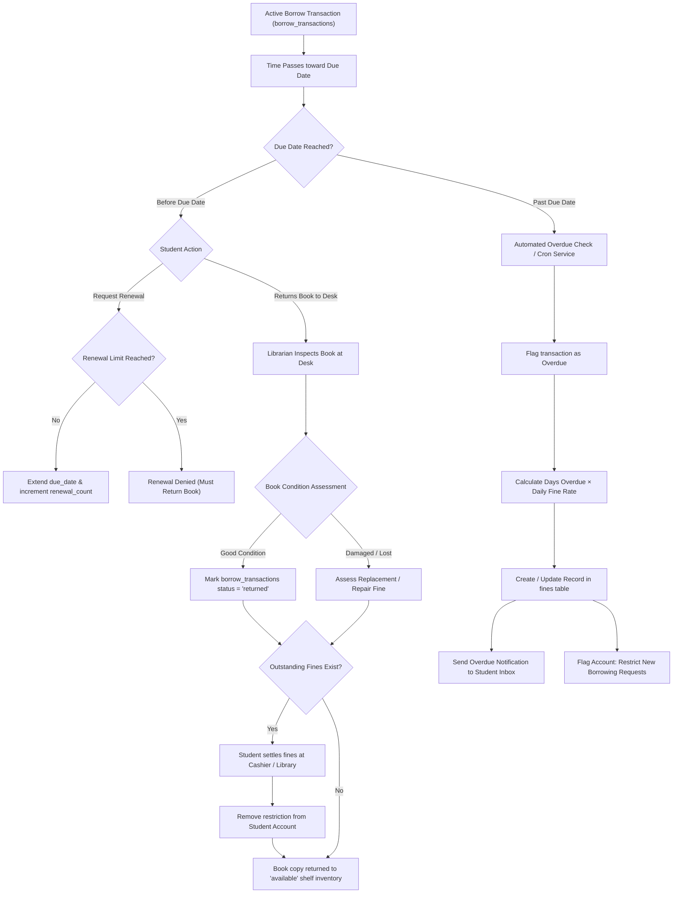
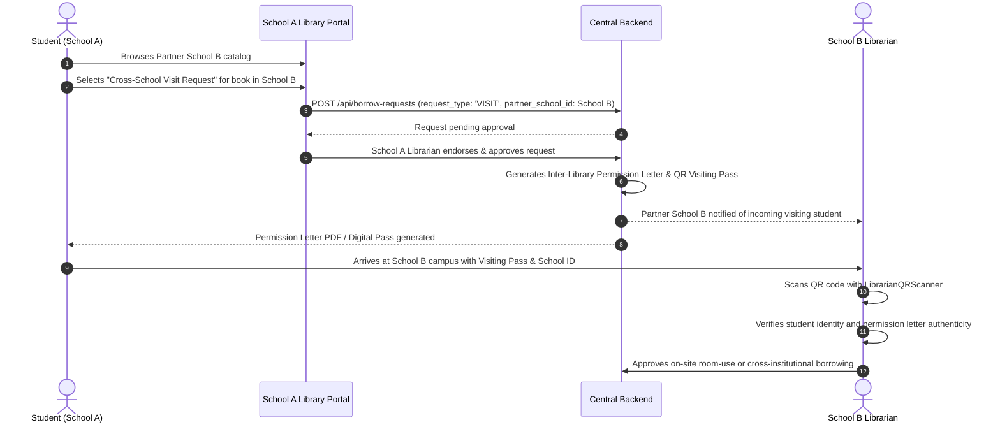

# LibraLink System Flow & Architecture Documentation

LibraLink is a multi-tenant, consortium-based Library Management and Inter-Library Loan (ILL) platform designed for colleges and universities. It enables institutions to manage their physical library catalogs while allowing students to discover, reserve, and borrow books across participating partner campuses through a secure digital access pass and QR code verification workflow.

---

## 1. System Architecture Overview



---

## 2. User Roles & Permission Matrix

| Role ID | Role Name | Primary Route | Scope & Responsibilities |
| :--- | :--- | :--- | :--- |
| **1** | **Super Admin** | `/superadmin` | Global consortium administrator. Registers schools, manages institutional subscriptions, oversees system-wide analytics, audits, and global user directory. |
| **2** | **Librarian Admin** | `/librarian-admin` | Head librarian / school administrator. Configures campus borrowing policies (loan periods, borrowing limits, daily overdue fines), manages staff accounts, audits activity logs, and oversees catalog inventory. |
| **3** | **Librarian** | `/librarian` | Front-desk library staff. Reviews and approves borrow requests, scans student QR access passes for check-in/check-out, inspects returned books, issues permission letters, and assesses overdue fines. |
| **4** | **Student** | `/studentpage` | Student / library patron. Discovers books across home and partner schools, adds books to borrow queue, submits borrow/visiting requests, tracks active loans, and presents digital QR access tokens. |

---

## 3. End-to-End Authentication & Onboarding Flow



---

## 4. Book Discovery & Catalog Search Flow

Students and staff navigate catalogs across both their home institution and partner libraries in the network.



---

## 5. Core Borrowing & Request Lifecycle

The borrowing flow distinguishes between **Home Library Borrowing** and **Inter-Library Partner School Visiting (Cross-School)**.



---

## 6. Digital QR Access Token Pass & Verification



---

## 7. Return, Overdue Detection & Fine Calculation Flow



---

## 8. Inter-Library Loan (Cross-School Consortium) Flow

When a student from **School A (Home)** wants to access or borrow a book physically located in **School B (Partner)**:



---

## 9. Database State Machine Reference

### 9.1 Borrow Request Lifecycle (`borrow_requests.status`)
```
[pending]
   │
   ├───> [rejected] (Librarian denies request with reason)
   ├───> [cancelled] (Student cancels before processing)
   │
   └───> [approved] / [permission_ready] (QR token created)
            │
            └───> [ready_for_pickup] (Librarian pulls book from shelf)
                     │
                     └───> [completed] (Physical book scanned & handed over)
```

### 9.2 Borrow Transaction Lifecycle (`borrow_transactions.status`)
```
[active]
   │
   ├───> [renewed] (Due date extended by policy allowance)
   │
   ├───> [returned] (Returned on or before due date in good condition)
   │
   ├───> [overdue] (Due date elapsed without return -> fines accumulate)
   │        │
   │        └───> [returned] (Returned late -> fines must be cleared)
   │
   └───> [lost] / [damaged] (Replacement assessment required)
```

### 9.3 Physical Book Copy Lifecycle (`book_copies.status`)
```
[available] ──(Checkout)──> [borrowed] ──(Check-in)──> [available]
     │                                                     ▲
     └──(Marked)──> [reserved] ──(Cancelled)───────────────┘
     │
     └──(Maintenance/Damage)──> [maintenance] / [lost]
```

---

## 10. Key API Route Reference

| Endpoint | Method | Role Allowed | Description |
| :--- | :--- | :--- | :--- |
| `/api/auth/login` | `POST` | Public | Authenticates user credentials, returns JWT and user metadata. |
| `/api/auth/signout` | `POST` | Authenticated | Logs out current session. |
| `/api/books/school` | `GET` | Authenticated | Retrieves catalog books filtered by `school_id`. |
| `/api/borrow-requests` | `POST` | Student | Creates new borrowing or cross-school visiting request. |
| `/api/borrow-requests` | `GET` | Staff / Student | Retrieves pending, approved, or historic requests. |
| `/api/borrow-requests/:id/approve` | `PUT` | Librarian Staff | Approves request and generates secure QR token. |
| `/api/borrow-requests/:id/reject` | `PUT` | Librarian Staff | Rejects request with reason. |
| `/api/borrows/verify-qr` | `POST` | Librarian Staff | Decodes and validates student QR access token. |
| `/api/borrows/checkout` | `POST` | Librarian Staff | Finalizes physical book checkout, assigns copy, creates active loan. |
| `/api/borrows/return` | `POST` | Librarian Staff | Records book return, inspects condition, computes final overdue fine. |
| `/api/fines/student/:id` | `GET` | Student / Staff | Retrieves unpaid and historic fines for a student. |
| `/api/notifications` | `GET` | Authenticated | Retrieves unread and recent system/action notifications. |
| `/api/schools` | `GET` | Authenticated | Lists participating consortium partner schools. |

---

## 11. Summary of Client Portals & File Mapping

- **Student Portal**:
  - Main container: `src/components/portals/student/StudentPortal.jsx`
  - Navigation & Layout: `src/components/collegeTabs/StudentTabs/StudentDashboardComponents.jsx`
  - Header search: `src/components/collegeTabs/StudentTabs/StudentHeaderSearch.jsx`
  - Catalog search: `src/components/collegeTabs/StudentTabs/StudentSearch.jsx`
  - Cart & Checkout: `src/components/collegeTabs/StudentTabs/StudentBorrowingList.jsx` & `StudentBorrowingForm.jsx`
  - Access Token Pass: `src/components/collegeTabs/StudentTabs/QRCodeDisplay.jsx`
- **Librarian Staff Portal**:
  - Main container: `src/components/portals/admin/LibrarianPortal.jsx`
  - Queue management: `src/components/collegeTabs/LibrarianTabs/LibrarianBorrowRequests.jsx`
  - Circulation QR Scanner: `src/components/collegeTabs/LibrarianTabs/LibrarianQRScanner.jsx`
  - Permission letter issuance: `src/components/collegeTabs/LibrarianTabs/LibrarianPermissionLetter.jsx`
- **Librarian Admin Portal**:
  - Main container: `src/components/portals/admin/LibrarianAdminPortal.jsx`
  - Fines & Policies: `src/components/collegeTabs/LibrarianAdminTabs/LibrarianAdminSettings.jsx`
- **Super Admin Portal**:
  - Main container: `src/components/portals/admin/Admin.jsx`
