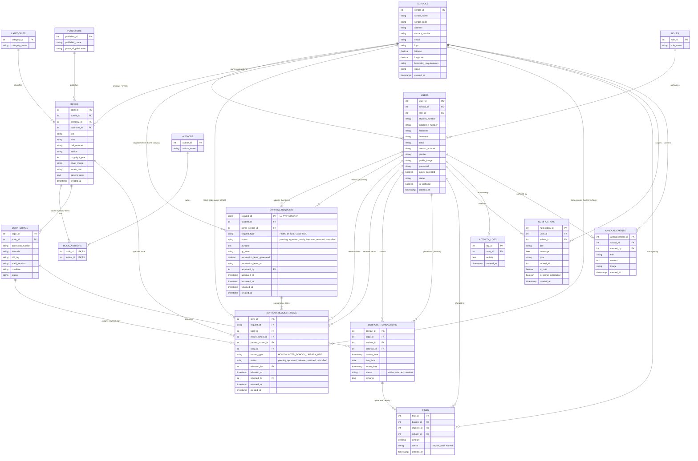

# LibraLink - Database Entity Relationship Diagram (ERD)

This document provides the complete **Physical Entity Relationship Diagram (ERD)** for the **LibraLink Multi-School Library Management System**, available in both **[dbdiagram.io](https://dbdiagram.io)** (DBML) and **[Mermaid](https://mermaid.js.org/)**.

> 📖 **Detailed Field-by-Field Data Dictionary**: See [docs/DATABASE_TABLES.md](file:///c:/xampp/htdocs/libralinkk/docs/DATABASE_TABLES.md) for full column specifications, types, constraints, and descriptions.

---

## 1. dbdiagram.io (DBML Format - Recommended)

[dbdiagram.io](https://dbdiagram.io/) is an online database diagram designer that renders interactive, color-coded, draggable ER diagrams directly from Database Markup Language (DBML).

### How to Use:
1. Open **[dbdiagram.io](https://dbdiagram.io/)** in your browser.
2. Click **"New Diagram"**.
3. Copy the DBML code from [docs/libralink_erd.dbml](file:///c:/xampp/htdocs/libralinkk/docs/libralink_erd.dbml) and paste it into the editor pane on the left.
4. Your interactive ERD with color-coded groups, cardinality connectors, and indexes will render instantly!
5. You can export as **PDF**, **PNG**, **SVG**, or generate **PostgreSQL SQL DDL**.

---

## 2. System Architecture ERD (Mermaid)

---

## 3. Core Subsystems & Relationship Dictionary

| Module | Primary Entities | Key Relationships & Cardinality | Business Logic / Constraints |
| :--- | :--- | :--- | :--- |
| **Multi-Tenancy & Users** | `SCHOOLS`, `ROLES`, `USERS` | - `SCHOOLS 1:N USERS` - `ROLES 1:N USERS` | Every student and librarian belongs to a specific institution (`school_id`). Super Admins have global visibility; school staff manage their respective tenant. |
| **Cataloging & Inventory** | `BOOKS`, `BOOK_COPIES`, `CATEGORIES`, `AUTHORS`, `PUBLISHERS`, `BOOK_AUTHORS` | - `SCHOOLS 1:N BOOKS` - `CATEGORIES 1:N BOOKS` - `PUBLISHERS 1:N BOOKS` - `BOOKS N:M AUTHORS` (via `BOOK_AUTHORS`) - `BOOKS 1:N BOOK_COPIES` | A `BOOK` represents bibliographic metadata (MARC/Dewey Dewey classification, title, ISBN). Individual physical books on shelves are tracked as `BOOK_COPIES` using unique `accession_number` and barcode. |
| **Borrowing & Inter-School Lending** | `BORROW_REQUESTS`, `BORROW_REQUEST_ITEMS`, `BOOK_COPIES` | - `USERS 1:N BORROW_REQUESTS` - `BORROW_REQUESTS 1:N BORROW_REQUEST_ITEMS` - `BOOK_COPIES 1:N BORROW_REQUEST_ITEMS` | Supports multi-item checkouts. `request_type` differentiates between **Home Campus** lending and cross-institutional **Inter-School** lending with automated permission letter and QR pickup token. |
| **Circulation Audit & Fines** | `BORROW_TRANSACTIONS`, `FINES` | - `BOOK_COPIES 1:N BORROW_TRANSACTIONS` - `BORROW_TRANSACTIONS 1:N FINES` | Tracks real-time active loans, return timestamps in Philippine Standard Time (PST UTC+8), overdue status, and fine generation. |
| **Audit, Feeds & Alerts** | `NOTIFICATIONS`, `ACTIVITY_LOGS`, `ANNOUNCEMENTS` | - `USERS 1:N NOTIFICATIONS` - `SCHOOLS 1:N ANNOUNCEMENTS` - `USERS 1:N ACTIVITY_LOGS` | 3-way real-time notification synchronization across Student, Librarian, and Admin-Librarian portals. |
