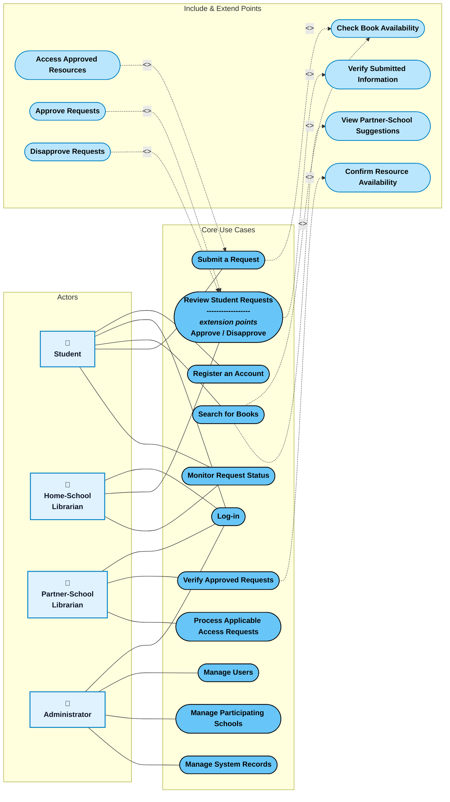

# LibraLink - UML Use Case Diagram

This diagram matches the exact UML design style from your reference image:
- **Stick-figure Actors** on the left with direct solid association lines
- **Sky-Blue Ovals (`#68C5F7`)** with dark borders for Use Cases
- **Dashed arrows (`-.->`) with `<<Include>>`** pointing to required sub-tasks
- **Dashed arrows (`-.->`) with `<<Extend>>`** pointing back to base use cases (Extension Points)
- **3-tier column layout**: Actors ➔ Base Use Cases ➔ Include / Extend Use Cases

---

## 1. Mermaid.ai Code (Copy & Paste directly)

---

## 2. UML Relationship Rules Applied

1. **Association (Solid Line `---`)**: Direct connection showing which actor triggers or interacts with a use case.
2. **`<<Include>>` (`-.->|"<<Include>>"|`)**: The base use case unconditionally executes the included use case:
   - When a Student performs **Search for Books**, it automatically includes **Check Book Availability** and **View Partner-School Suggestions**.
   - When a Student performs **Submit a Request**, it unconditionally includes **Check Book Availability**.
   - When a Home-School Librarian performs **Review Student Requests**, it includes **Verify Submitted Information**.
   - When a Partner-School Librarian performs **Verify Approved Requests**, it includes **Confirm Resource Availability**.
3. **`<<Extend>>` (`-.->|"<<Extend>>"|`)**: Conditional branch extending the base use case under specific conditions:
   - **Access Approved Resources** extends **Submit a Request** (only after formal approval and issuance of access pass).
   - **Approve Requests** and **Disapprove Requests** extend **Review Student Requests** based on librarian decision.
